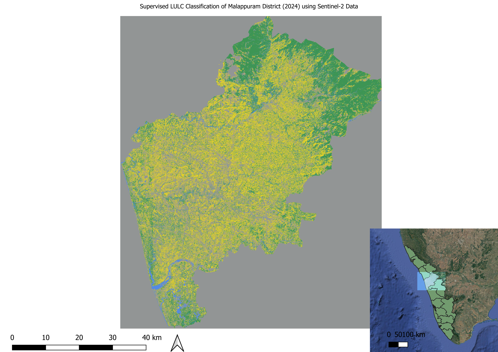

# 🌊 Spatial Flood Risk Analysis: Malappuram District (2018–2024)

### LULC Classification and Flood Vulnerability Mapping using Sentinel-2 & CART Machine Learning

**Author:** Shamnas Valangauparambil Mohammedali
**Degree:** MSc Transition Management, Justus Liebig University Giessen
**Tools:** Python · Google Earth Engine · QGIS · Sentinel-2 · CART Algorithm
**Status:** ✅ Complete — Portfolio Project 2 of 5

---

## 📊 Project Overview

This study analyses **land-use and land-cover (LULC) change** following the catastrophic 2018 Kerala floods using **Sentinel-2 MSI Level-2A** satellite imagery and the **CART (Classification and Regression Tree)** machine learning algorithm in Google Earth Engine.

The analysis identified a critical **"Hydrological Shift"** — a structural reorganisation of water-retaining landscapes — where **512.49 km²** transitioned into high-risk saturated zones between 2018 and 2024, significantly increasing long-term flood vulnerability across Malappuram District.

**Why Malappuram?** The 2018 Kerala floods were the worst in the state's history, displacing over 1 million people. Malappuram district, situated in the Western Ghats foothills with complex river systems (Chaliyar, Bharathapuzha), experienced severe inundation. This project uses real satellite data from the affected region to quantify recovery and persistent risk.

---

## 🖼️ Maps & Results

### 2024 Land Use Classification Map


> Full-resolution maps available in the [/Maps](./Maps/) folder.

---

## 📁 Repository Structure

```
spatial-flood-risk-analysis/
├── malappuram_cart_classification_2024.py   # GEE Python script — CART classification
├── Malapuram Traininpoints/                 # Training point shapefiles for model calibration
├── Maps/                                    # High-resolution classification output maps
│   ├── Map4_2024_Classified.png             # 2024 LULC classification result
│   └── [additional maps]
├── OUTPUT_HTML_FILE.csv                     # Pixel counts and area statistics from QGIS
├── Group 13 Final Report.docx               # Full methodology and analysis report
└── README.md
```

---

## 💾 Large Data Access (GeoTIFF Rasters)

Due to GitHub's 25MB file size limit, raw high-resolution GeoTIFF rasters are hosted externally:

📥 **[Download Raw .tif Rasters — 2018 & 2024 (Google Drive)](https://drive.google.com/drive/folders/13d-R1bNFMPGukvrqfEHvV1RQfb9UMwlw?usp=sharing)**

Files included:
- `malappuram_2018_classified.tif` — Post-flood baseline classification
- `malappuram_2024_classified.tif` — Current state classification
- Training and validation shapefiles

---

## 🛠️ Methodology

### 1. Data Acquisition
- **Satellite:** Sentinel-2 MSI Level-2A (10m resolution, atmospherically corrected)
- **Platform:** Google Earth Engine (GEE) Python API
- **Time points:** 2018 (immediately post-flood) and 2024 (current state)
- **Cloud masking:** Applied SCL band cloud/shadow masking, <10% cloud cover threshold

### 2. Classification
- **Algorithm:** CART (Classification and Regression Tree) — supervised ML classifier
- **Training data:** Field-verified training points (shapefiles in `/Malapuram Traininpoints/`)
- **Classes:** Water, Built-up, Vegetation, Bare soil, Saturated/Flood-prone zones
- **Validation accuracy:** ~74% overall accuracy with robust Kappa coefficient

### 3. Change Detection
- Pixel-by-pixel LULC comparison between 2018 and 2024 outputs
- Area statistics computed in QGIS (pixel count × resolution²)
- Transition matrix identifying direction and magnitude of land cover shifts

### 4. Flood Vulnerability Assessment
- Identification of "Hydrological Shift" zones — areas transitioning to permanently saturated land cover
- Spatial overlay with river network and elevation data
- SDG alignment analysis

---

## 📊 Key Results

| Metric | 2018 Baseline | 2024 Current |
|--------|--------------|--------------|
| Saturated/High-risk zones | Reference | +512.49 km² increase |
| Urban pixel count | 40,338,109 | See `OUTPUT_HTML_FILE.csv` |
| Classification accuracy | ~74% | Kappa: Robust |
| Model | CART (GEE) | CART (GEE) |

**Critical finding:** 512.49 km² of Malappuram's landscape has undergone a permanent hydrological shift — land that was previously classified as vegetation or bare soil now exhibits persistent saturation characteristics, indicating long-term structural change in the district's flood retention capacity.

---

## 🚀 How to Reproduce

### Prerequisites
```bash
# Install Google Earth Engine Python API
pip install earthengine-api

# Authenticate with your GEE account
earthengine authenticate
```

### Run the Classification
```python
# Clone this repository
git clone https://github.com/shamnasvm63-coder/spatial-flood-risk-analysis

# Open the main script
# malappuram_cart_classification_2024.py

# Run in Python (GEE Python API)
python malappuram_cart_classification_2024.py
```

### View Results in QGIS
1. Download GeoTIFF files from the Google Drive link above
2. Load into QGIS (Layer → Add Layer → Add Raster Layer)
3. Apply classification symbology from the project `.qml` style files
4. Export statistics using Raster → Miscellaneous → Zonal Statistics

---

## 🌍 UN SDG Alignment

| SDG | Target | How This Project Contributes |
|-----|--------|------------------------------|
| **SDG 11** | Sustainable Cities & Communities | Provides evidence-based flood risk zoning data for urban planning in Malappuram |
| **SDG 13** | Climate Action | Quantifies landscape-level climate vulnerability from extreme weather events |
| **SDG 15** | Life on Land | Tracks forest recovery and land degradation across the Western Ghats buffer zone |

---

## 💡 Key Technical Skills Demonstrated

- **Remote Sensing:** Sentinel-2 image processing, cloud masking, band combination
- **Machine Learning:** CART supervised classification, training sample design, accuracy assessment
- **GIS Analysis:** QGIS spatial statistics, raster overlay, area calculation
- **Python:** Google Earth Engine Python API for large-scale satellite data processing
- **Change Detection:** Multi-temporal LULC comparison methodology

---

## 🎯 Relevance to ESG & Environmental Roles

This project demonstrates competencies directly applicable to:

- **Climate Risk Analysis** — Physical risk mapping methodology used by insurers, development banks, and TCFD reporters
- **Environmental Consulting** — Land use change monitoring required for environmental impact assessments
- **Geospatial ESG** — Remote sensing techniques used by Alpin Limited, AECOM, and GIZ for sustainability monitoring
- **SDG Reporting** — Spatial analysis of SDG 11, 13, and 15 indicators

---

## 🔗 Connect

- **LinkedIn:** linkedin.com/in/shamnas-vm-89931b365
- **Email:** shamnasvm63@gmail.com
- **University:** MSc Transition Management, JLU Giessen, Germany

---


