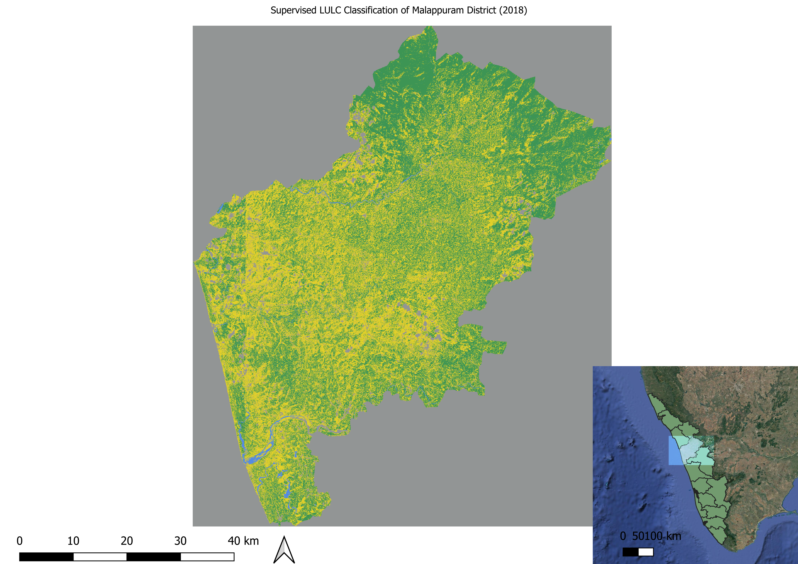
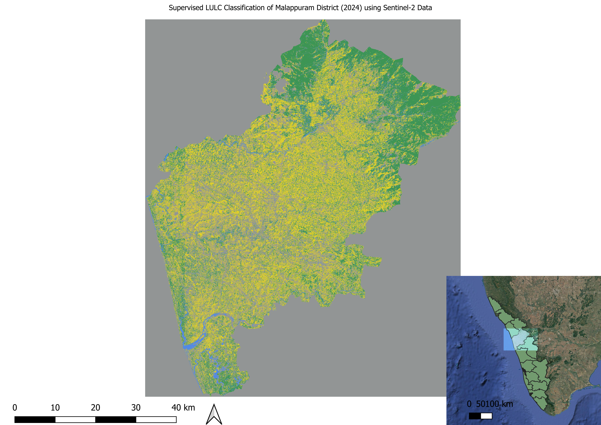
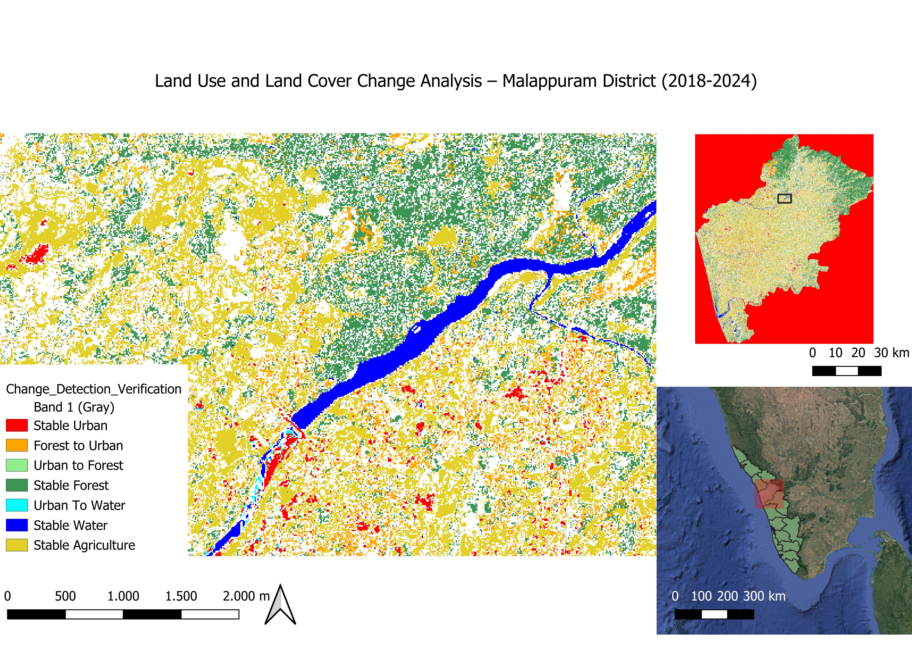
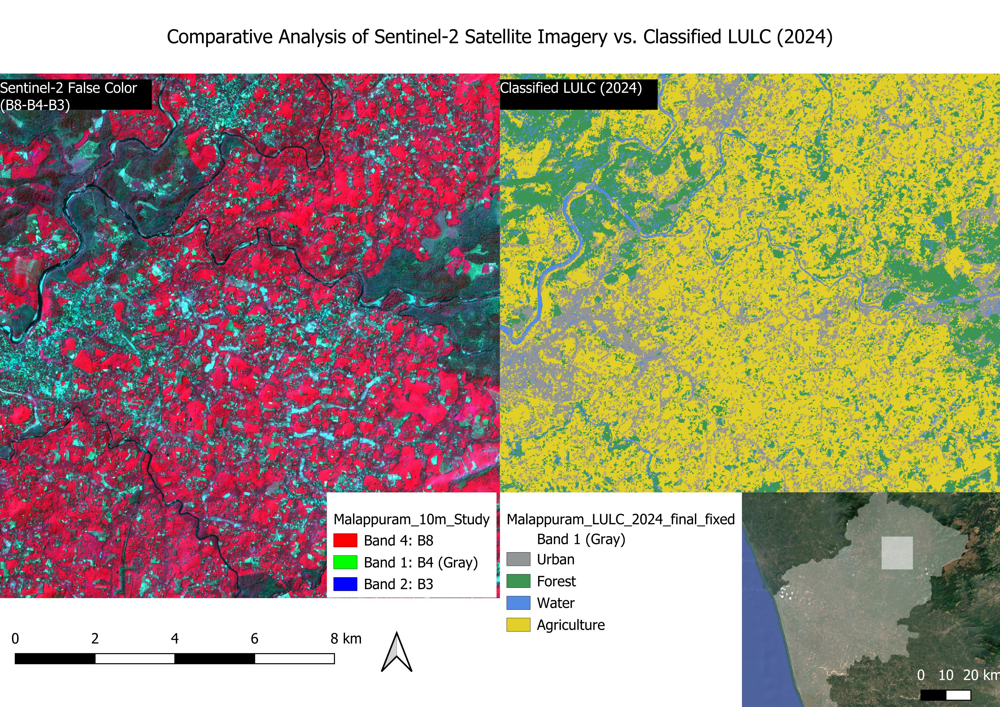

<p align="center">
  
</p>

<h1 align="center">🌊 Spatial Flood Risk Analysis: Malappuram District (2018–2024)</h1>
<h3 align="center">LULC Classification & Flood Vulnerability Mapping using Sentinel-2 & CART Machine Learning</h3>

<p align="center">
  
  
  
  
  
  
</p>

<p align="center">
  <b>Author:</b> Shamnas Valangauparambil Mohammedali &nbsp;|&nbsp;
  <b>Degree:</b> MSc Transition Management, Justus Liebig University Giessen
</p>

---

## 📑 Table of Contents

- [Project Overview](#-project-overview)
- [Maps & Results](#️-maps--results)
- [Repository Structure](#-repository-structure)
- [Large Data Access](#-large-data-access-geotiff-rasters)
- [Methodology](#️-methodology)
- [Key Results](#-key-results)
- [How to Reproduce](#-how-to-reproduce)
- [UN SDG Alignment](#-un-sdg-alignment)
- [Key Technical Skills Demonstrated](#-key-technical-skills-demonstrated)
- [Relevance to ESG & Environmental Roles](#-relevance-to-esg--environmental-roles)
- [Connect](#-connect)

---

## 📊 Project Overview

This study analyses **land-use and land-cover (LULC) change** following the catastrophic 2018 Kerala floods using **Sentinel-2 MSI Level-2A** satellite imagery and the **CART (Classification and Regression Tree)** machine learning algorithm in Google Earth Engine.

The analysis identified a critical **"Hydrological Shift"** — a structural reorganisation of water-retaining landscapes — where **512.49 km²** transitioned into high-risk saturated zones between 2018 and 2024, significantly increasing long-term flood vulnerability across Malappuram District.

**Why Malappuram?** The 2018 Kerala floods were the worst in the state's history, displacing over 1 million people. Malappuram district, situated in the Western Ghats foothills with complex river systems (Chaliyar, Bharathapuzha), experienced severe inundation. This project uses real satellite data from the affected region to quantify recovery and persistent risk.

---

## 🖼️ Maps & Results

<table>
<tr>
<td width="50%">
<p align="center"><b>2018 Baseline Classification</b><br>(Post-Flood)</p>

</td>
<td width="50%">
<p align="center"><b>2024 Classification</b><br>(Current State)</p>

</td>
</tr>
<tr>
<td width="50%">
<p align="center"><b>2024 Malappuram LULC Overview</b></p>

</td>
<td width="50%">
<p align="center"><b>NDVI Vegetation Index</b></p>

</td>
</tr>
<tr>
<td width="50%">
<p align="center"><b>Training Points Methodology</b></p>

</td>
<td width="50%">
<p align="center"><b>LULC Change Analysis (2018 → 2024)</b></p>

</td>
</tr>
<tr>
<td width="50%">
<p align="center"><b>Accuracy Validation (Zoomed)</b></p>

</td>
<td width="50%"></td>
</tr>
</table>

> Full-resolution maps available in the [/Maps](./Maps/) folder.

---

## 📁 Repository Structure

```
spatial-flood-risk-analysis/
├── malappuram_cart_classification_2024.py   # QGIS Earth Engine (ee_plugin) script — CART classification
├── Malappuram Training Points/               # Field-verified training & validation shapefiles
├── Maps/                                     # High-resolution classification output maps (7 images)
│   ├── Map2_2018_Classified.png              # 2018 baseline classification
│   ├── Map4_2024_Classified.png              # 2024 classification result
│   ├── Map7_Malappuram_LULC_2024.png         # 2024 LULC overview
│   ├── Map 7_NDVI.png                        # NDVI vegetation index
│   ├── Map6_Training_Points_Methodology.png  # Training points methodology
│   ├── Map_08_LULC_Change_Analysis_Final.jpg # Change analysis (2018→2024)
│   └── Map_09_Accuracy_Validation_Zoom.jpg   # Accuracy validation (zoomed)
├── flood_risk_map_preview.png                # Repository preview banner
├── OUTPUT_HTML_FILE.csv                      # Pixel counts and area statistics from QGIS
├── QGIS Final Report.docx                     # Full methodology and analysis report
└── README.md
```

---

## 💾 Large Data Access (GeoTIFF Rasters)

Due to GitHub's 25MB file size limit, the two raw high-resolution GeoTIFF rasters are hosted externally. Training and validation shapefiles are **included directly in this repository** under [`/Malappuram Training Points`](./Malappuram%20Training%20Points/) — only the rasters below need a separate download.

📥 **[Download Raw .tif Rasters — 2018 & 2024 (Google Drive)](https://drive.google.com/drive/folders/13d-R1bNFMPGukvrqfEHvV1RQfb9UMwlw?usp=sharing)**

Files included:
- `Malappuram_LULC_2018_Final.tif` — Post-flood baseline classification
- `Malappuram_LULC_2024_Final.tif` — Current state classification

---

## 🛠️ Methodology

### 1. Data Acquisition
- **Satellite:** Sentinel-2 MSI Level-2A (10m resolution, atmospherically corrected)
- **Platform:** Google Earth Engine (GEE), accessed via the QGIS Earth Engine plugin
- **Time points:** 2018 (immediately post-flood) and 2024 (current state)
- **Cloud masking:** Applied SCL band cloud/shadow masking, <10% cloud cover threshold

### 2. Classification
- **Algorithm:** CART (Classification and Regression Tree) — supervised ML classifier
- **Training data:** Field-verified training points (shapefiles in `/Malappuram Training Points/`)
- **Classes:** Water, Built-up, Vegetation, Bare soil, Saturated/Flood-prone zones
- **Validation accuracy:** ~74% overall accuracy with robust Kappa coefficient

### 3. Change Detection
- Pixel-by-pixel LULC comparison between 2018 and 2024 outputs
- Area statistics computed in QGIS (pixel count × resolution²)
- Transition matrix identifying direction and magnitude of land cover shifts

### 4. Flood Vulnerability Assessment
- Identification of "Hydrological Shift" zones — areas transitioning to permanently saturated land cover
- Spatial overlay with river network and elevation data
- SDG alignment analysis

---

## 📊 Key Results

| Metric | 2018 Baseline | 2024 Current |
|--------|---------------|--------------|
| Saturated/High-risk zones | Reference | +512.49 km² increase |
| Urban pixel count | 40,338,109 | See `OUTPUT_HTML_FILE.csv` |
| Classification accuracy | ~74% | Kappa: Robust |
| Model | CART (GEE) | CART (GEE) |

**Critical finding:** 512.49 km² of Malappuram's landscape has undergone a permanent hydrological shift — land that was previously classified as vegetation or bare soil now exhibits persistent saturation characteristics, indicating long-term structural change in the district's flood retention capacity.

---

## 🚀 How to Reproduce

This project's Earth Engine script was developed and run **inside QGIS**, using the **Google Earth Engine plugin (`ee_plugin`)** — not as a standalone Python script. To reproduce it:

### Prerequisites
1. Install [QGIS](https://qgis.org/) (3.x)
2. In QGIS, open **Plugins → Manage and Install Plugins**, search for **"Google Earth Engine"**, and install the plugin
3. Follow the plugin's authentication steps to connect your GEE account

### Run the Classification
1. Clone this repository:
   ```bash
   git clone https://github.com/shamnasvm63-coder/spatial-flood-risk-analysis
   ```
2. Open QGIS and launch the **Python Console** (Plugins → Python Console)
3. Open and run `malappuram_cart_classification_2024.py` from the console
4. Training points from `/Malappuram Training Points/` are loaded automatically by the script

### View Results in QGIS
1. Download the GeoTIFF files from the Google Drive link above
2. Load into QGIS (Layer → Add Layer → Add Raster Layer)
3. Apply classification symbology to match the maps in `/Maps`
4. Export statistics using Raster → Miscellaneous → Zonal Statistics

---

## 🌍 UN SDG Alignment

| SDG | Target | How This Project Contributes |
|-----|--------|------------------------------|
| **SDG 11** | Sustainable Cities & Communities | Provides evidence-based flood risk zoning data for urban planning in Malappuram |
| **SDG 13** | Climate Action | Quantifies landscape-level climate vulnerability from extreme weather events |
| **SDG 15** | Life on Land | Tracks forest recovery and land degradation across the Western Ghats buffer zone |

---

## 💡 Key Technical Skills Demonstrated

- **Remote Sensing:** Sentinel-2 image processing, cloud masking, band combination
- **Machine Learning:** CART supervised classification, training sample design, accuracy assessment
- **GIS Analysis:** QGIS spatial statistics, raster overlay, area calculation
- **Geospatial Scripting:** Google Earth Engine API via QGIS for large-scale satellite data processing
- **Change Detection:** Multi-temporal LULC comparison methodology

---

## 🎯 Relevance to ESG & Environmental Roles

This project demonstrates competencies directly applicable to:

- **Climate Risk Analysis** — Physical risk mapping methodology used by insurers, development banks, and TCFD reporters
- **Environmental Consulting** — Land use change monitoring required for environmental impact assessments
- **Geospatial ESG** — Remote sensing techniques used for sustainability and climate-risk monitoring
- **SDG Reporting** — Spatial analysis of SDG 11, 13, and 15 indicators

---

## 🔗 Connect

- **LinkedIn:** [linkedin.com/in/shamnas-vm-89931b365](https://linkedin.com/in/shamnas-vm-89931b365)
- **Email:** shamnasvm63@gmail.com
- **University:** MSc Transition Management, JLU Giessen, Germany

---

<p align="center"><i>⭐ If this project is useful to you, consider starring the repository.</i></p>
